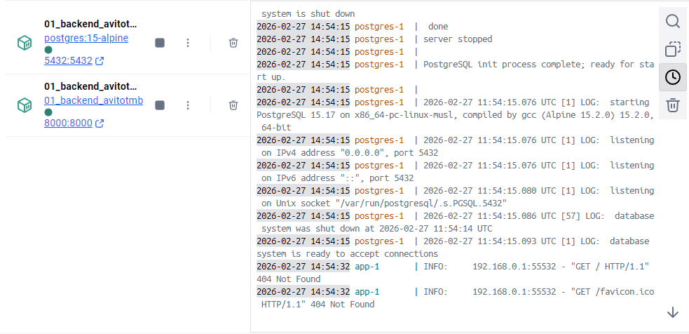
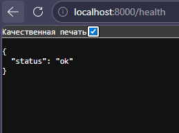
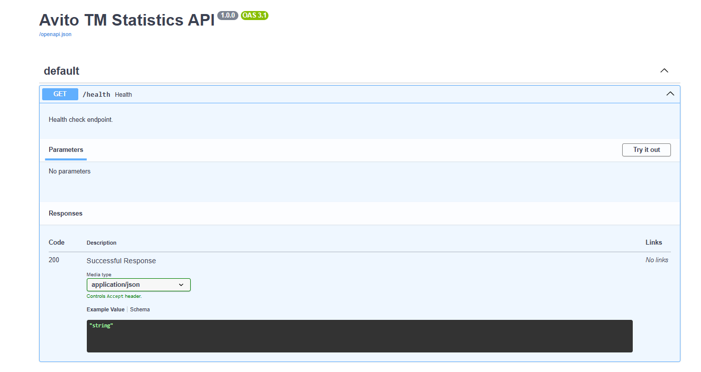
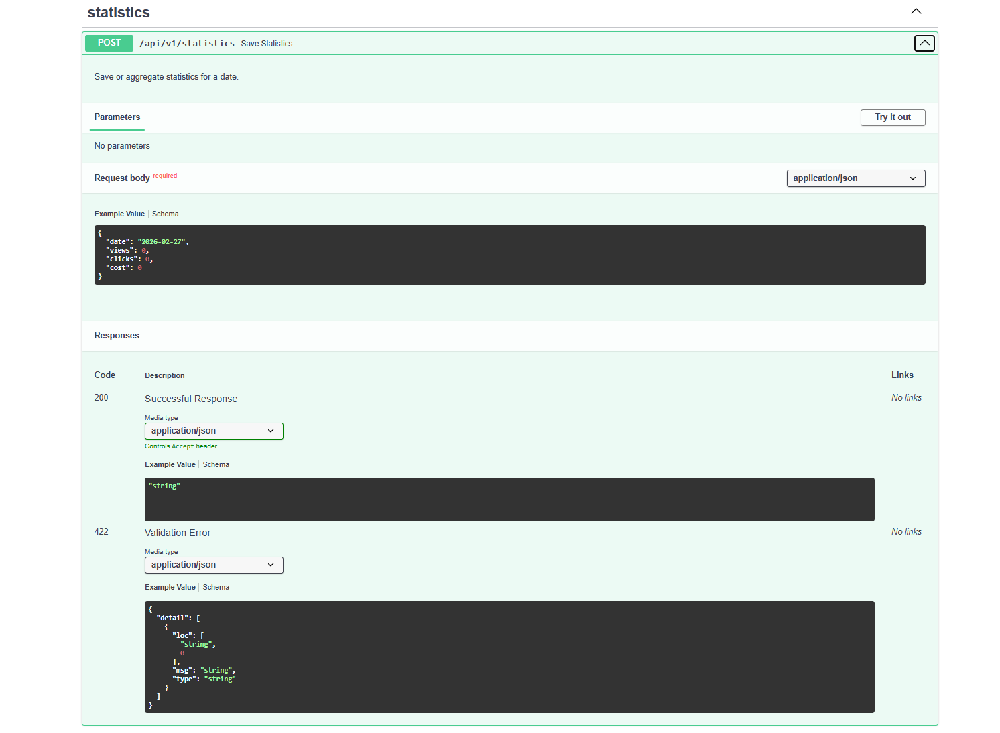
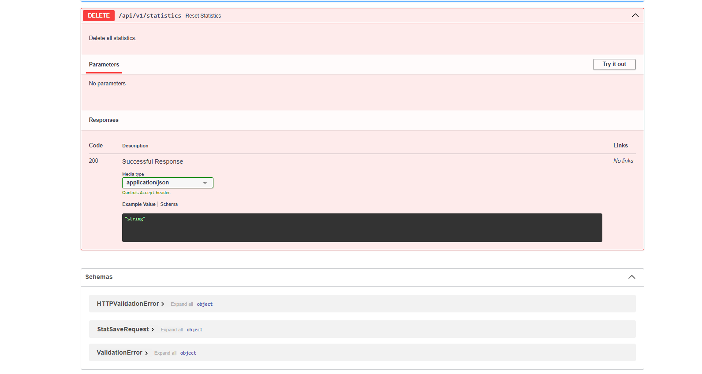

# Скриншоты работающего приложения

## avitotmbackend

### 1. Health check

```
GET /health
Response: {"status":"ok"}
```

### 2. Сохранение статистики

```
POST /api/v1/statistics
Body: {"date": "2025-02-27", "views": 100, "clicks": 10, "cost": 50.5}
Response: {"status":"ok"}
```

### 3. Получение статистики

```
GET /api/v1/statistics?from=2025-02-01&to=2025-02-28
Response: [{"date":"2025-02-27","views":100,"clicks":10,"cost":"50.50","cpc":"5.05","cpm":"505.0"}]
```

### 4. Swagger документация

Доступна по адресу http://localhost:8000/docs

## Скриншоты

Скриншоты работы API:






