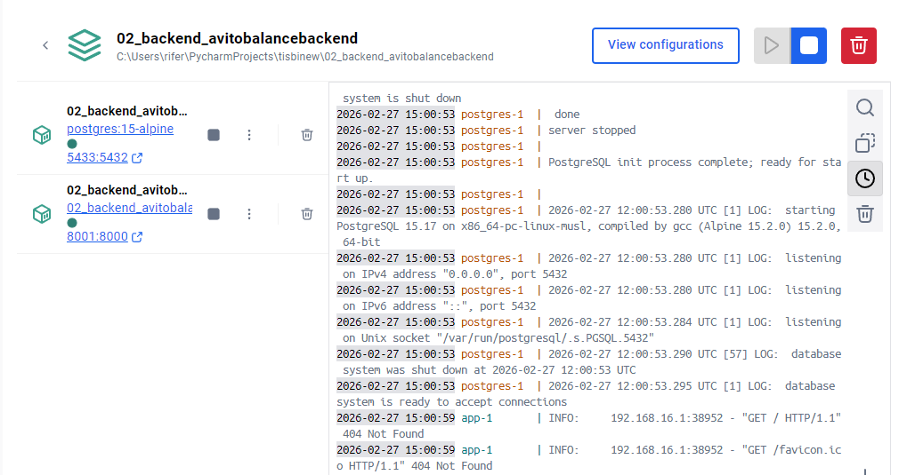
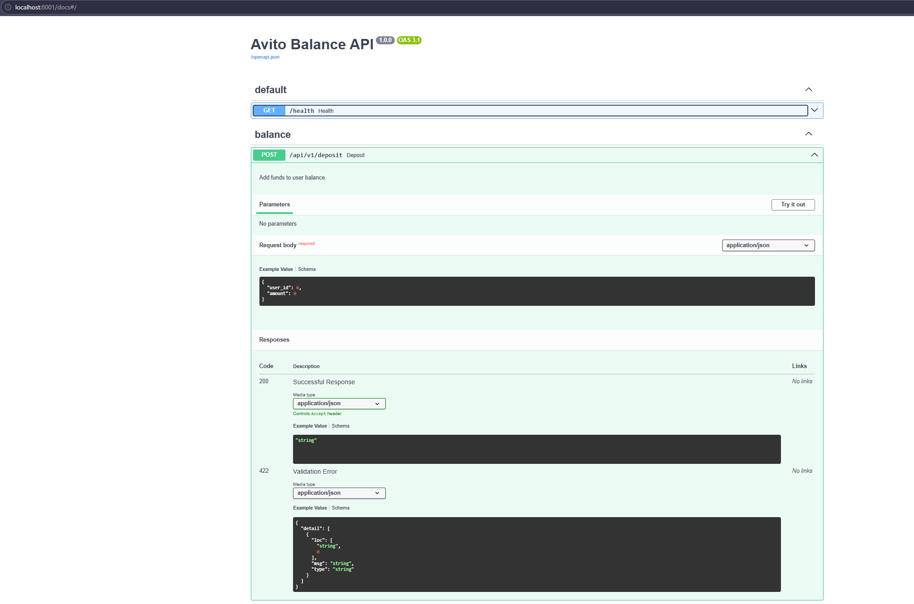
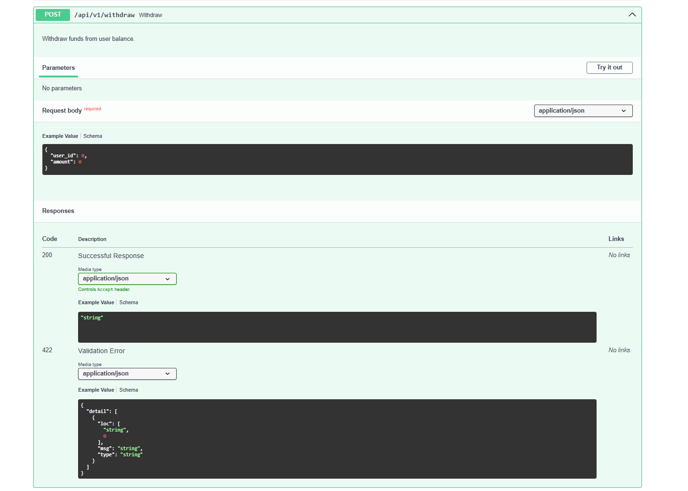
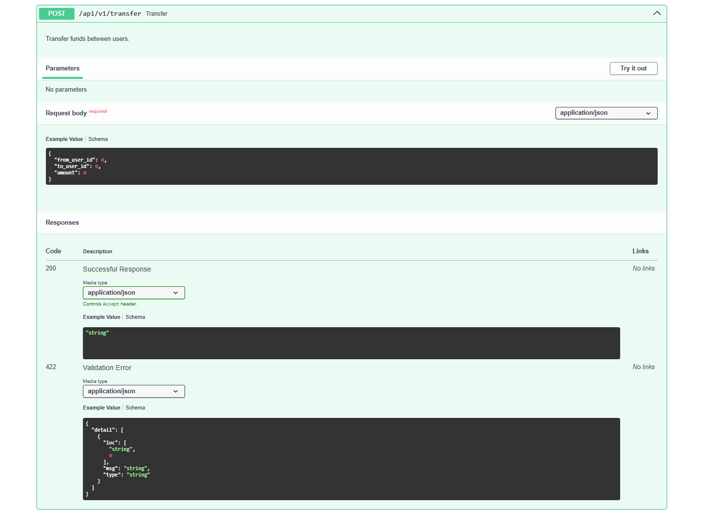
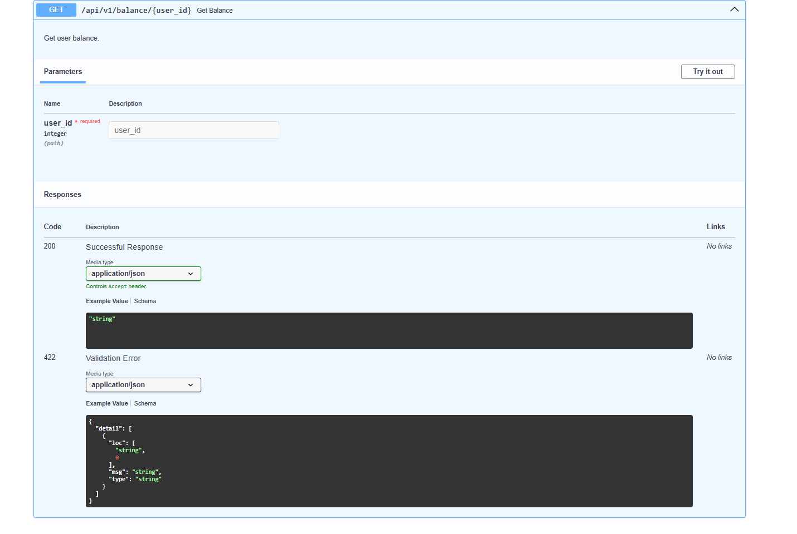
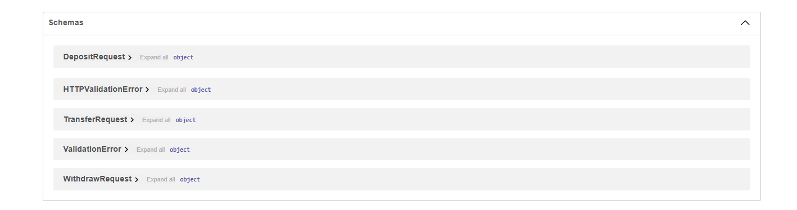

# Скриншоты avitobalancebackend

- POST /api/v1/deposit: начисление
- GET /api/v1/balance/{user_id}: получение баланса
- POST /api/v1/transfer: перевод между пользователями
- POST /api/v1/withdraw: списание
- Swagger: http://localhost:8001/docs

## Скриншоты

Скриншоты работы API:

