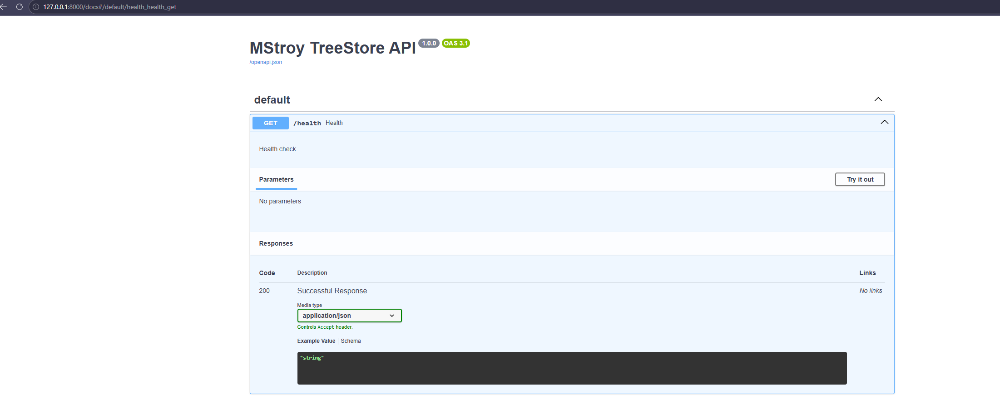
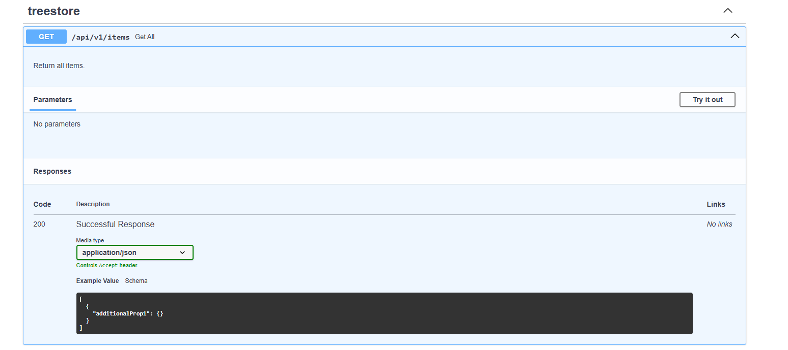
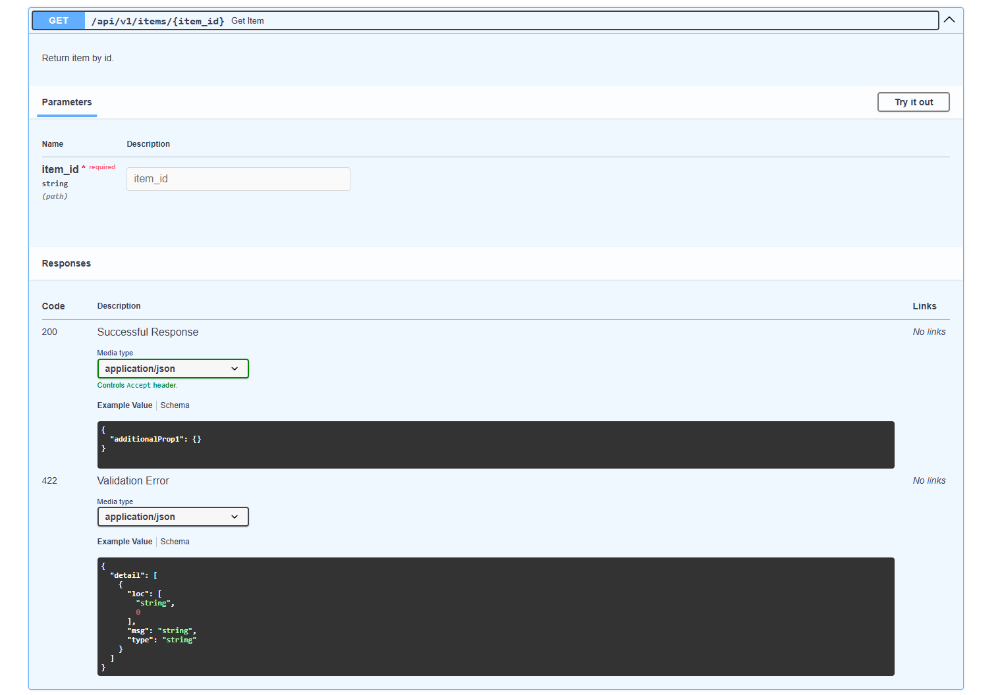
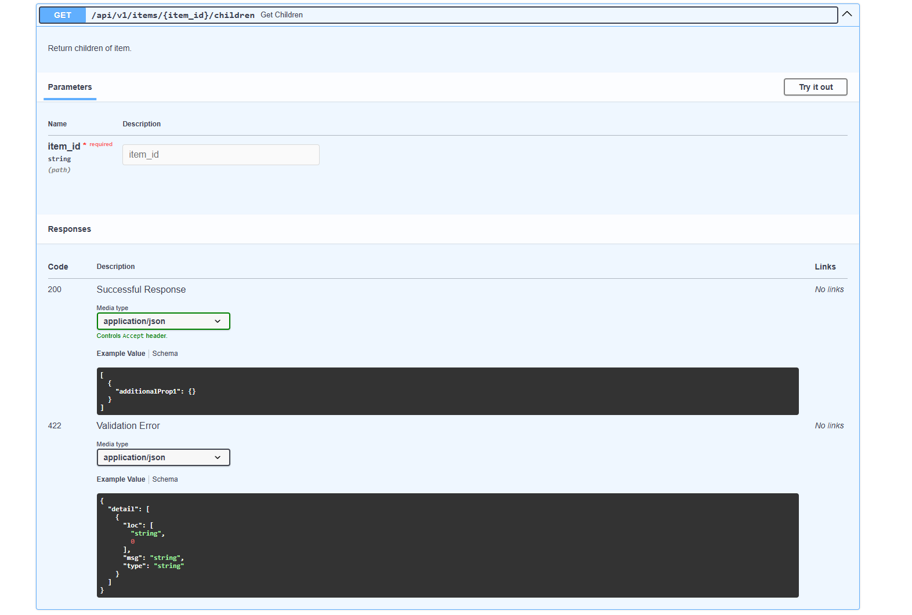
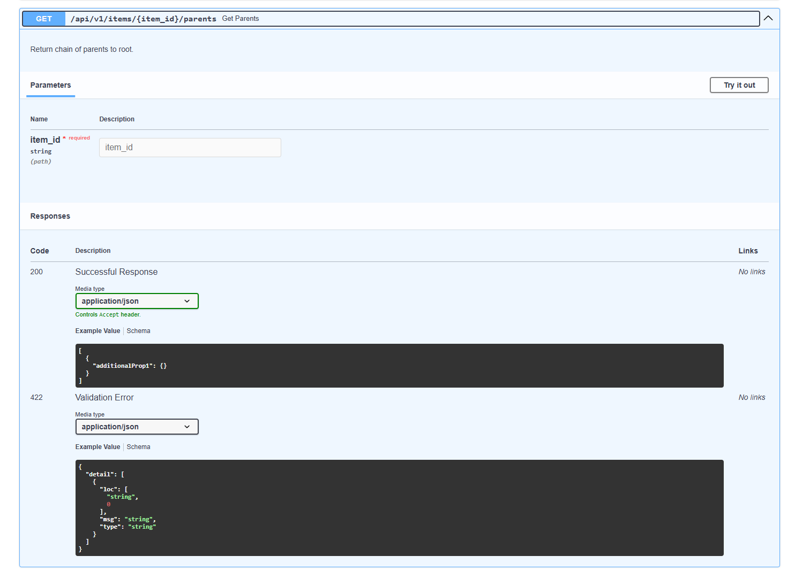
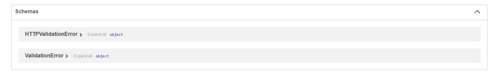

# Скриншоты mstroybackend

- GET /api/v1/items — все элементы
- GET /api/v1/items/7 — элемент по id
- GET /api/v1/items/4/children — дочерние
- GET /api/v1/items/7/parents — цепочка родителей
- Swagger: http://localhost:8000/docs

## Скриншоты

Скриншоты работы API:

