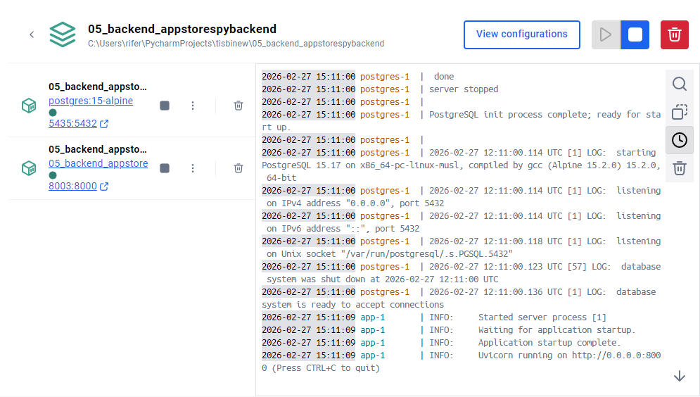
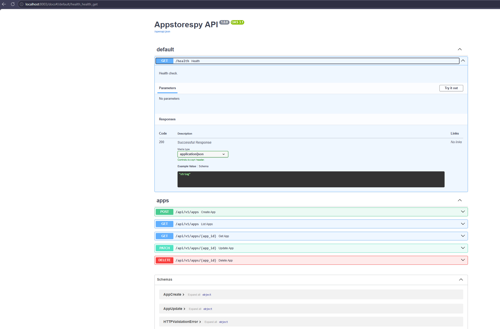
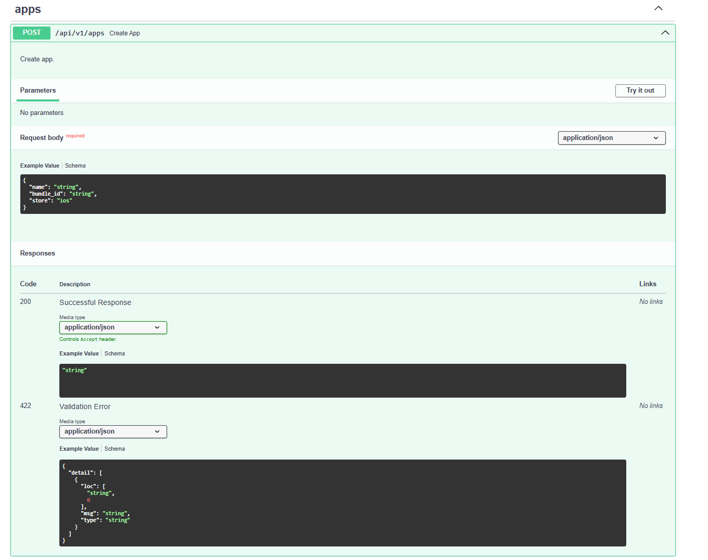
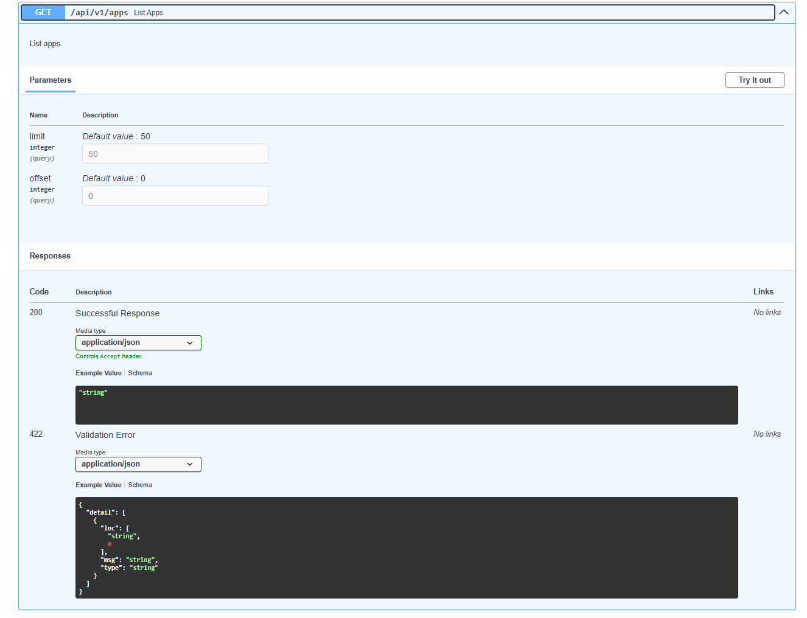
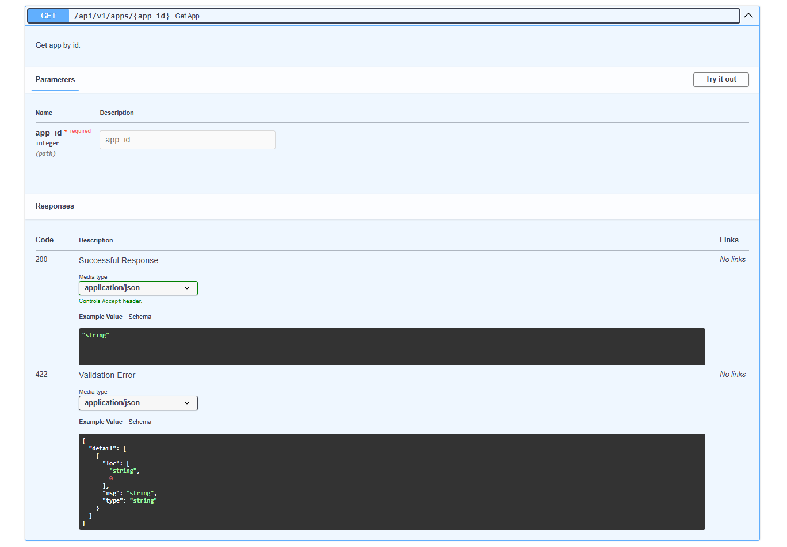
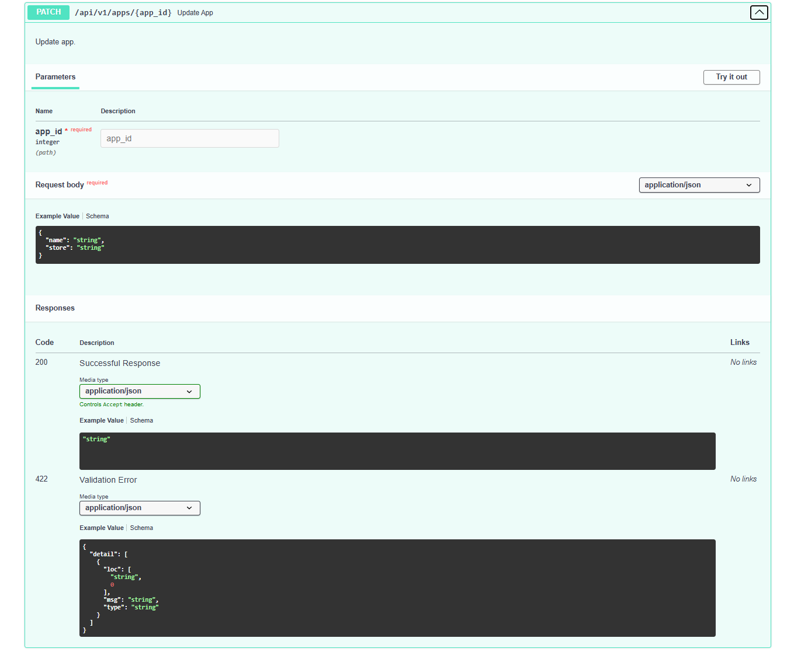
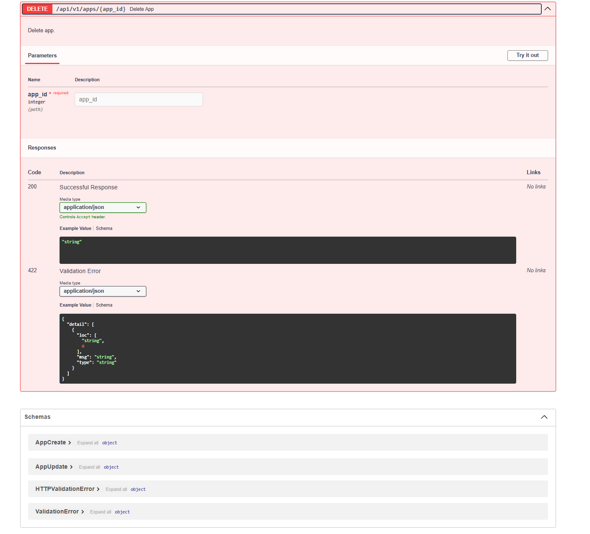

# Скриншоты appstorespybackend

- POST /api/v1/apps — создать приложение
- GET /api/v1/apps — список
- GET /api/v1/apps/{id} — получить
- PATCH /api/v1/apps/{id} — обновить
- DELETE /api/v1/apps/{id} — удалить
- Swagger: http://localhost:8003/docs

## Скриншоты

Скриншоты CRUD‑операций и интерфейса:

